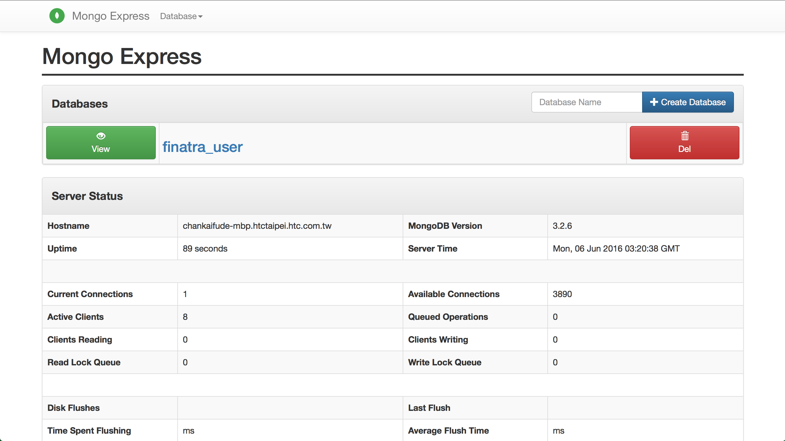

# Getting started with MongoDB and Scala
The simple project demonstrate how to integrate Scala and MongoDB via [MongoDB Scala Driver] (https://mongodb.github.io/mongo-scala-driver/)

## Prerequisite
You can get information how to setup a Scala project with Finatra:
https://github.com/caxton/52-technologies-in-2016/tree/master/01-finatra

##Install MongoDB
### Step 1: Install MongoDB

1. [Install MongoDB Community Edition on Linux] (https://docs.mongodb.com/manual/tutorial/install-mongodb-on-ubuntu/)
2. [Install MongoDB Community Edition on OS X] (https://docs.mongodb.com/manual/tutorial/install-mongodb-on-os-x/#install-mongodb-community-edition)
3. [Install MongoDB Community Edition on Windows] (https://docs.mongodb.com/manual/tutorial/install-mongodb-on-windows/)

### Step 2: Run MongoDB

Please refer to [Run MongoDB] (https://docs.mongodb.com/manual/tutorial/install-mongodb-on-os-x/#run-mongodb) or you can simply run it:
```
mongod --dbpath ~/data/db/
```

or run the server in the background
```
mongod --dbpath ~/data/db --fork --logpath ~/log/mongodb.log
```

### Step 3: Install MongoDB Admin UI

You can install any UI in [Admin UIs] (https://docs.mongodb.com/ecosystem/tools/administration-interfaces/).
Here we take [mongo-express] (http://www.npmjs.org/package/mongo-express) an example, after install the package, you can run it:
```
mongo-express -u [account] -p [password] -d [database]
```

Then you can see the admin page on default URL http://localhost:8081 and the page as shown below:


## Building an application from scratch
[MongoDB Scala Driver] (https://mongodb.github.io/mongo-scala-driver/) : The official MongoDB Scala Driver, providing asynchronous event-based observable sequences for MongoDB.

### Step 1: Adding required dependencies to build.sbt
```
libraryDependencies += "org.mongodb.scala" %% "mongo-scala-driver" % "1.1.1"
```

### Step 2: Follow the smaple code to build up your project

MongoDB Scala Driver [Quick Tour] (http://mongodb.github.io/mongo-scala-driver/1.1/getting-started/quick-tour/).


##appendix
### Using cURL to automate HTTP jobs

get all users' weight
```
curl -i http://localhost:8888/mongodb/weights
```

get someone's weight
```
curl -i http://localhost:8888/mongodb/weights/user_name
```

create/update an user
```
curl -H "Content-Type: application/json" -i http://localhost:8888/mongodb/weights -X POST -d '{"user":"Simon","weight":"100","status":"awesome","posted_at":"2016-01-03T14:34:06.871Z"}'
```

delete an user
```
curl -i http://localhost:8888/mongodb/weights/del/user_name
```
